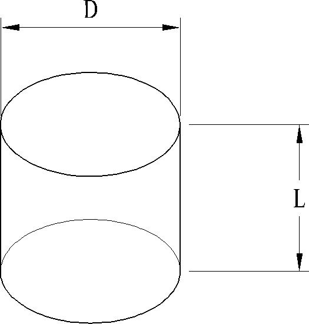
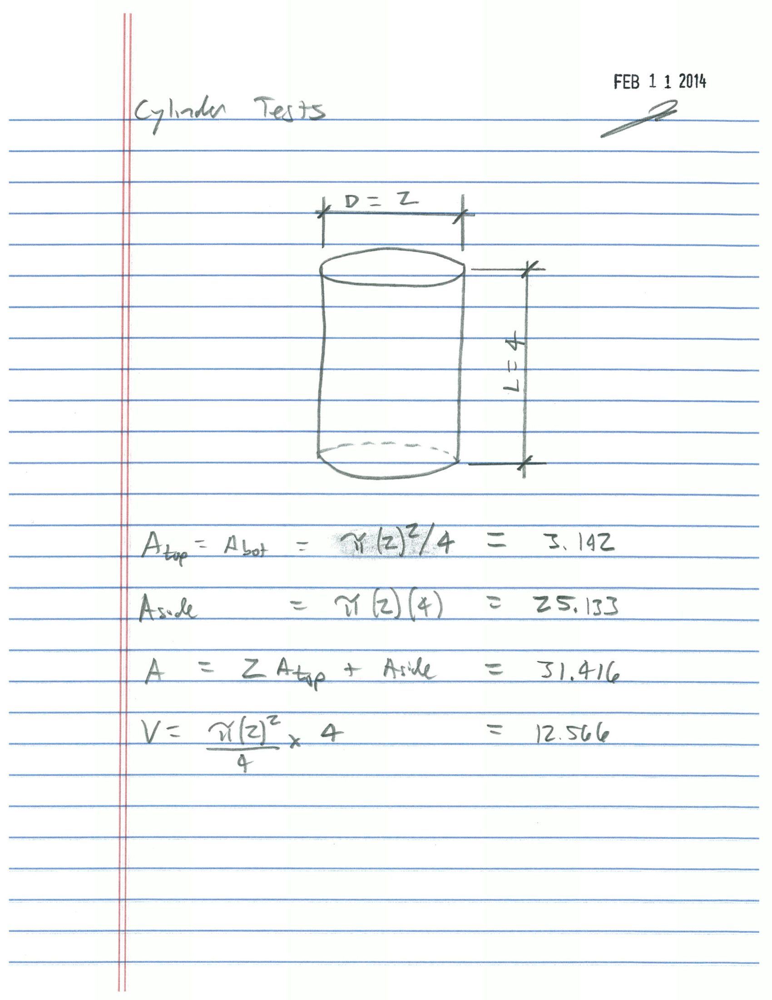

Cylinder
========

   Cylinder

Radius:

.. math::
   :label: eq-cylinder-radius

   R = \dfrac{D}{2}

Volume:

.. math::
   :label: eq-cylinder-volume

   V = \dfrac{\pi D^2 L}{4} = \pi R^2 L

Area of Top or Bottom:

.. math::
   :label: eq-cylinder-area-top

   A_{top} = A_{bot} = \dfrac{\pi D^2}{4} = \pi R^2

Area of Side:

.. math::
   :label: eq-cylinder-area-side

   A_{side} = \pi D L = 2 \pi R L

Surface Area:

.. math::
   :label: eq-cylinder-area

   A = \dfrac{2 \pi D^2}{4} + \pi D L = 2 \pi R^2 + 2 \pi R L

Cylinder Property Tests
-----------------------

   Cylinder Property Tests

