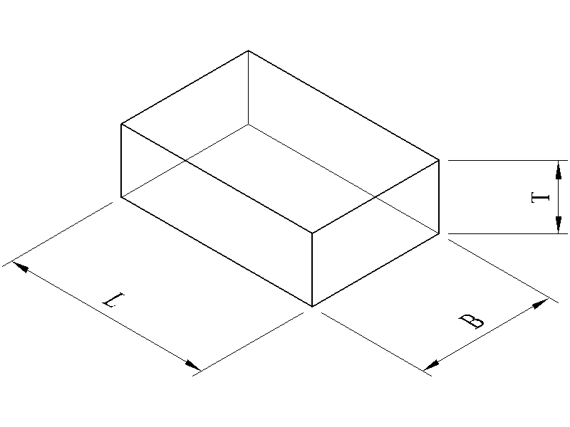

Rectangular Prism
=================

   Rectangular Prism

Volume:

.. math::
   :label: eq-rectangular-prism-volume

   V = B L T

Area of Top or Bottom:

.. math::
   :label: eq-rectangular-prism-area-top

   A_{top} = A_{bot} = B L

Area of Front or Back:

.. math::
   :label: eq-rectangular-prism-area-front

   A_{front} = A_{back} = L T

Area of Left or Right End:

.. math::
   :label: eq-rectangular-prism-area-end

   A_{end} = B T

Surface Area:

.. math::
   :label: eq-rectangular-prism-area

   A = 2 (BL + BT + LT)

